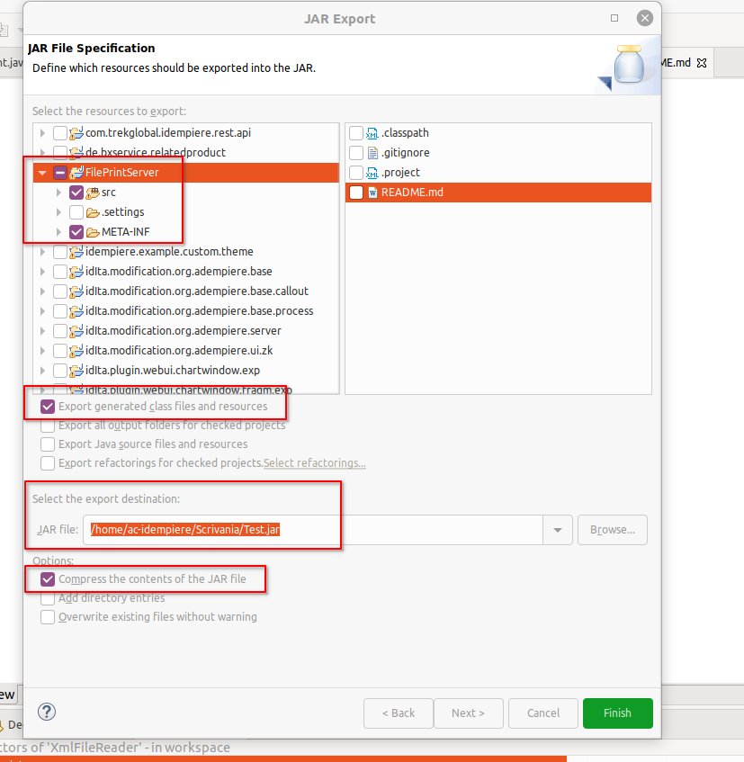
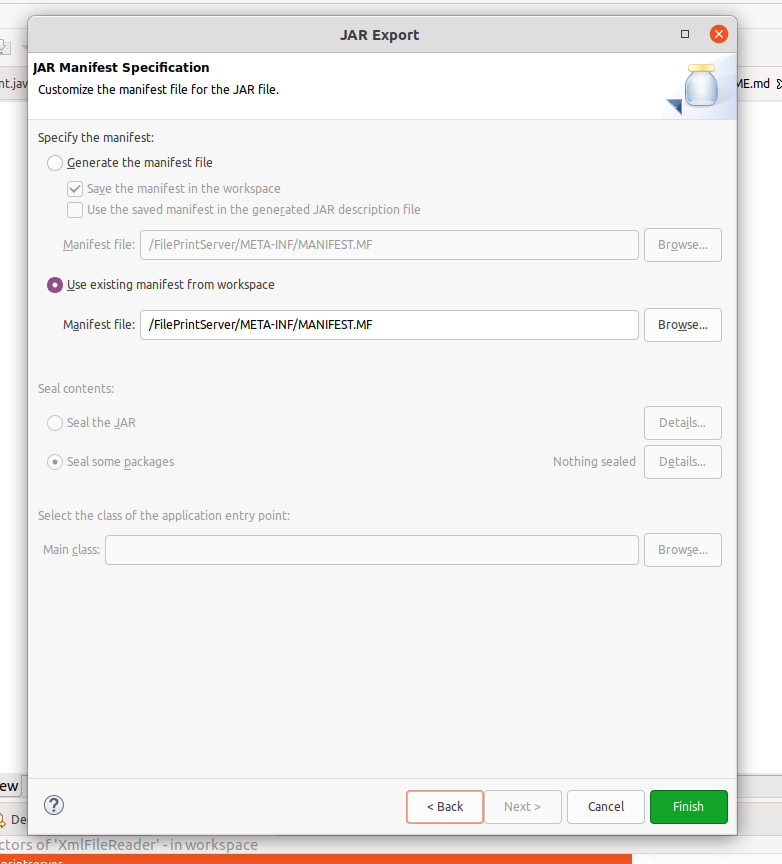

Procedura per creazione jar.

1. Tasto DX sul progetto e poi "Export"

2. Selezionare "Java> JAR file" + NEXT

3. La finestra selezionerà la cartella principale del progetto e a destra la lista dei file presenti sulla cartella principale: selezionare solo "src" e "META-INF" ed esportare solo la generazione dei .class
   Opzioni --> "Compress......"

   +NEXT

   

4. Lasciare i flag attivi degli "Export....." + NEXT
5. 
	+ FINISH
